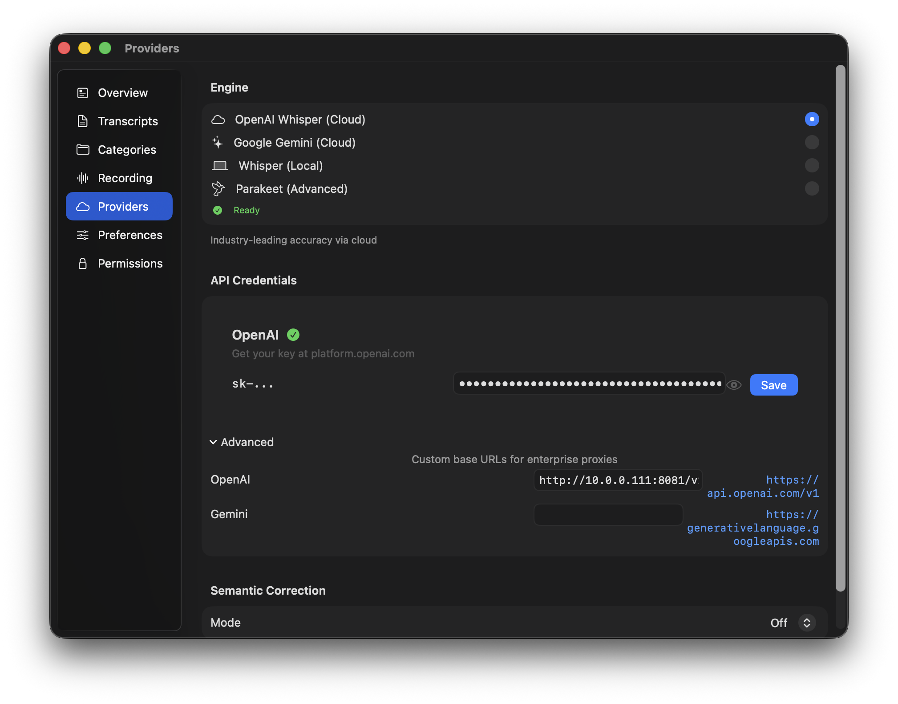

# Home Dictation API

A self-hosted, CPU-friendly dictation API for your home lab. It exposes an OpenAI-compatible `POST /v1/audio/transcriptions` endpoint for LAN use, with a small Docker-first setup aimed at short dictation clips.

## Quick Start

Create a `compose.yaml` file on your server:

```yaml
services:
  dictation-api:
    image: yashkh03/home-dictation-api:latest
    restart: unless-stopped
    ports:
      - "8080:8080"
    volumes:
      - /srv/home-dictation-api/hf-cache:/opt/hf-cache
      - /srv/home-dictation-api/models:/opt/models
```

Then start the service:

```bash
docker compose up -d
```

> **Note:** The first boot downloads and compiles the model. Give it a few minutes for the server to report healthy.

## Tested Clients

- OpenWhispr
- AudioWhisper
- Other clients that let you set a custom OpenAI-style transcription endpoint should also work

## OpenWhispr

- Provider: `Custom`
- Endpoint URL: `http://<server-ip>:8080/v1`
- Model: `whisper-1`


## AudioWhisper

- Engine: `OpenAI Whisper (Cloud)`
- Advanced base URL: `http://<server-ip>:8080/v1`
- Model: `whisper-1`



## Notes

- Endpoint: `http://<server-ip>:8080/v1`
- LAN-first for now
- Short dictation clips only for now, about `15` seconds max after decode/resampling
- Oversized uploads are rejected early; `MAX_UPLOAD_BYTES` defaults to `16 MiB`
- Batch transcription only
