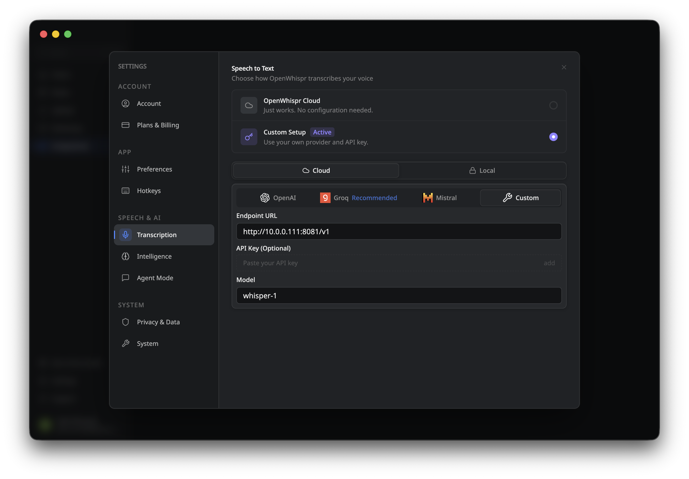

# Home Dictation API

A self-hosted, CPU-friendly dictation service for your home lab. It runs entirely on your local server and exposes an OpenAI-compatible transcription API, making it easy to plug into existing clients across your entire network.

## Quick Start

Create a `compose.yaml` file on your server:

```yaml
services:
  dictation-api:
    image: yashkh03/home-dictation-api:latest
    restart: unless-stopped
    ports:
      - "8080:8080"
    volumes:
      - /srv/home-dictation-api/hf-cache:/opt/hf-cache
      - /srv/home-dictation-api/models:/opt/models
```

Then start the service:

```bash
docker compose up -d
```

> **Note:** The first boot downloads the model. Give it a few minutes for the server to report healthy.

## OpenWhispr

- Provider: `Custom`
- Endpoint URL: `http://<server-ip>:8080/v1`
- API Key: leave blank
- Model: `whisper-1`



## Notes

- Endpoint: `http://<server-ip>:8080/v1`
- Short dictation clips only for now, about `15` seconds max
- Batch transcription only
